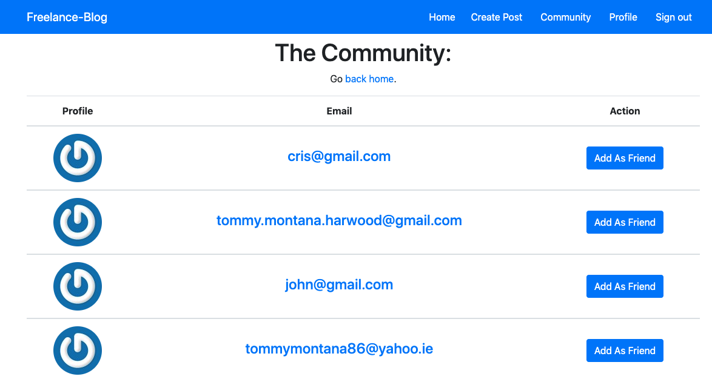
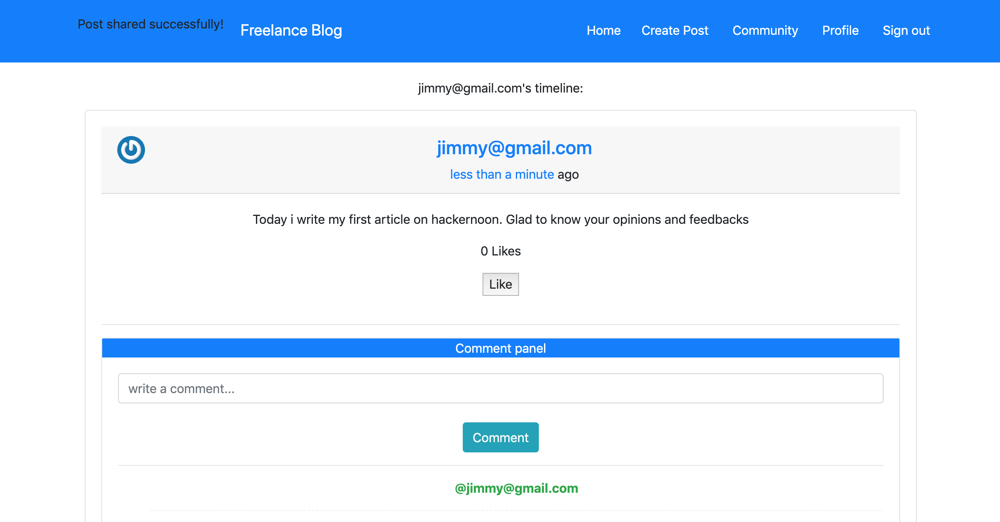
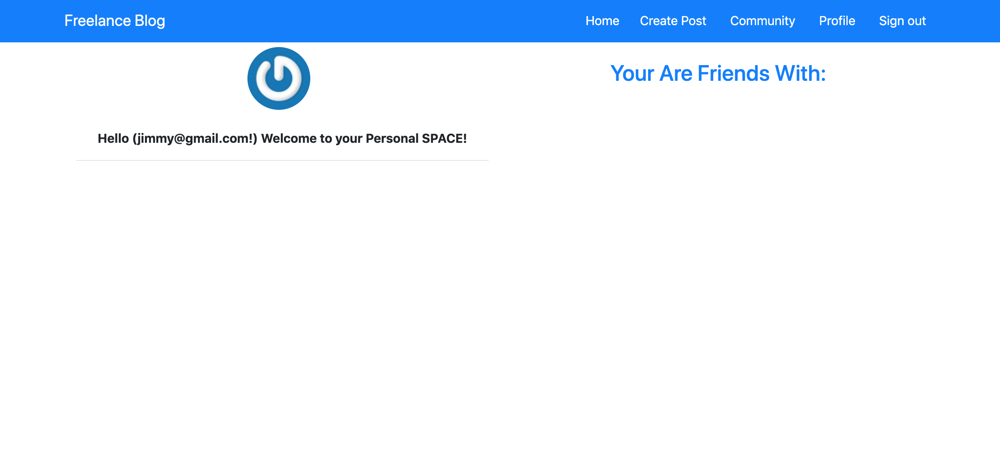
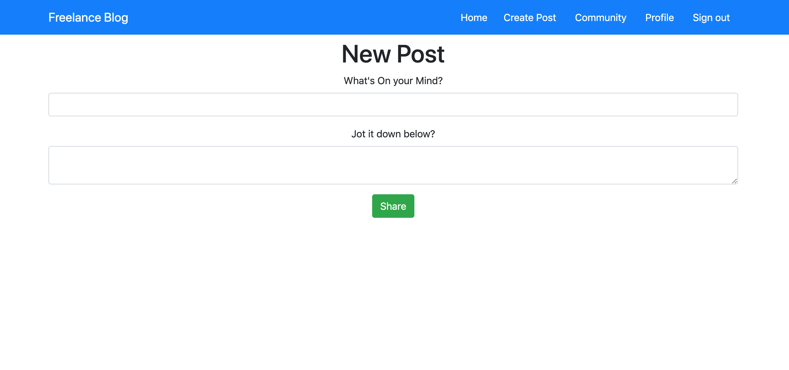

# Ruby on Rails Freelance Blog Application

> In this project we are building a Freelance Blog social network application.


<br>
<br>

## Users Community Page




<br>
<br>

## Users Posts Page whit likes and comments




<br>
<br>

## Users Friends




<br>
<br>

## Users Create Post Page




<br>
<br>

Additional description about the project and its features.

## Built With

- **Major languages:** *Ruby, JavaScript & CSS,*
- **Frameworks:** *Ruby on Rails (RoR), Sass, & Bootstrap,*
- **Technologies used:** *git, PostgreSQL, Heroku, GitHub.*
- **Methodologies:** *TDD & BDD (with RSpec), Love & Passion*
- **Editors:** *VSCode*
- **Browser:** *Chrome*

## Live Demo

[The App](https://fathomless-cove-35496.herokuapp.com/users/sign_in)

## Getting Started

> **If you want to checkout the working of the code in your local machine, first off, you need to clone this repo and install the required dependencies in your system. The instructions to do this are listed below:**
>> To get a local copy up and running follow these simple example steps.
***

### Prerequisites

>We we are using rbenv as our environment.
>> 1. rbenv version:~> 1.1.2-20-
>> 2. Ruby version: ~> 2.6.5
>> 3. Rails knowledge.
>> 4. git knowledge.
>> 5. postgresql database installed in the local machine.

***

### Setup

```git clone git@github.com:ChristianOtieno/rails-facebook.git```
***

### Install

1.```bundle install```

2.```rails db:create```

3.```rails db:migrate```
***

### Usage

```rails server```
***

### Run tests

```rspec```
***

## Authors

👤 **Author1**

- Github: [@ChristianOtieno](https://github.com/ChristianOtieno)
- Twitter: [@iamchrisotieno](https://twitter.com/iamchrisotieno)
- Linkedin: [Christian Otieno](https://www.linkedin.com/in/christianotieno/)

👤 **Author2**

- Github: [@TommyM0ntana](https://github.com/TommyM0ntana)
- Twitter: [@tommymo13761893](https://twitter.com/tommymo13761893)
- Linkedin: [Tommy Montana](https://www.linkedin.com/in/tommy-h-montana/)


## 🤝 Contributing

Contributions, issues and feature requests are welcome!


## Show your support

Give a ⭐️ if you like this project!

## Acknowledgments

- Hat tip to anyone whose code was used.

## 📝 License

This project is [MIT](https://opensource.org/licenses/MIT) licensed.
